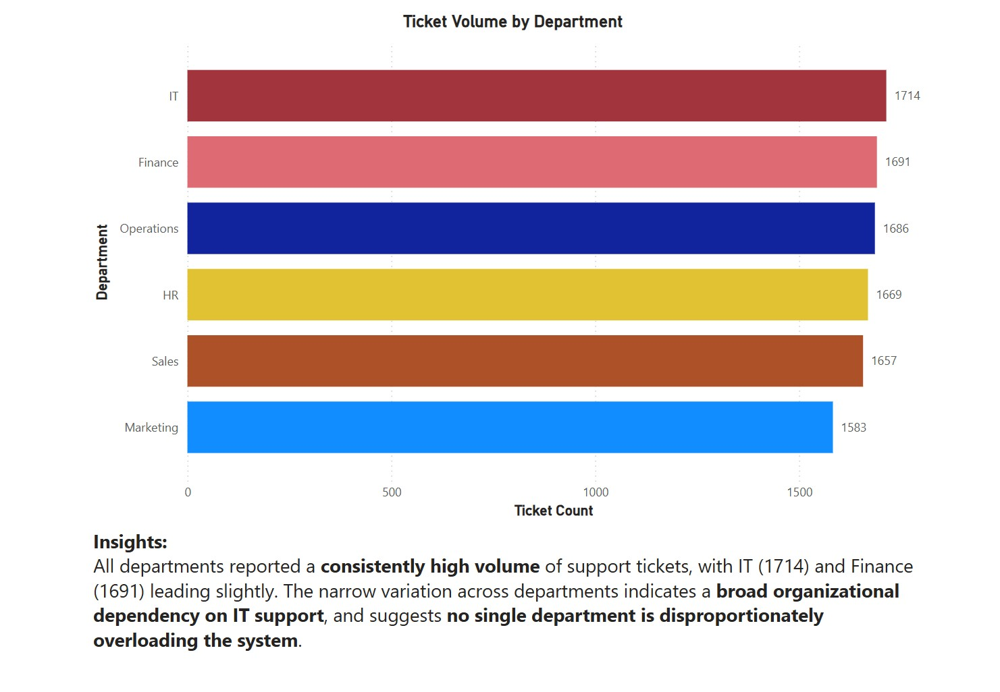
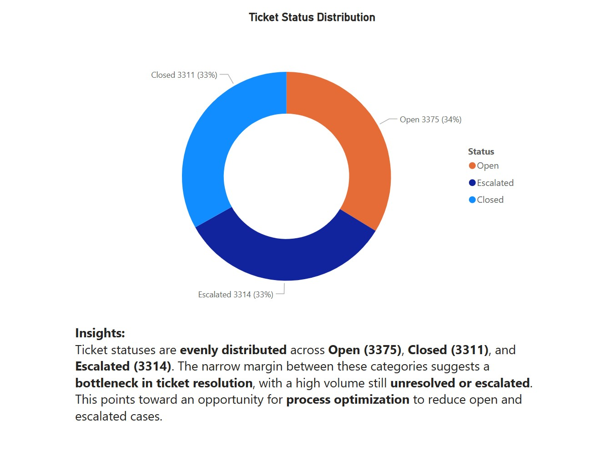
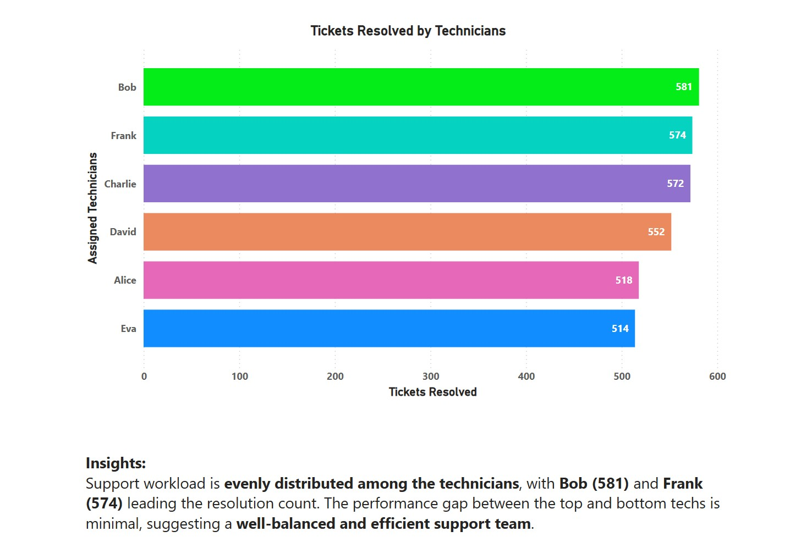
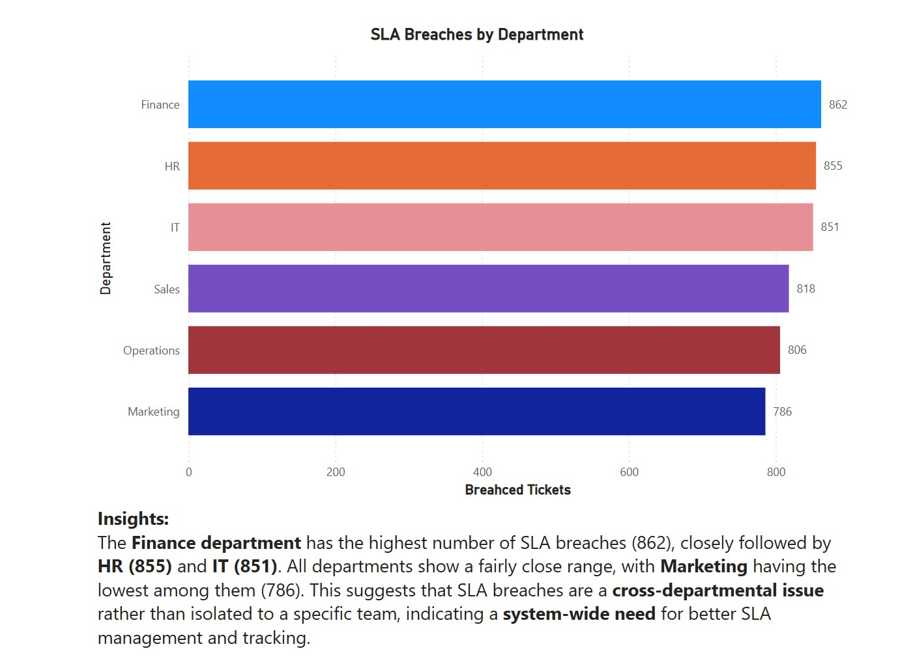
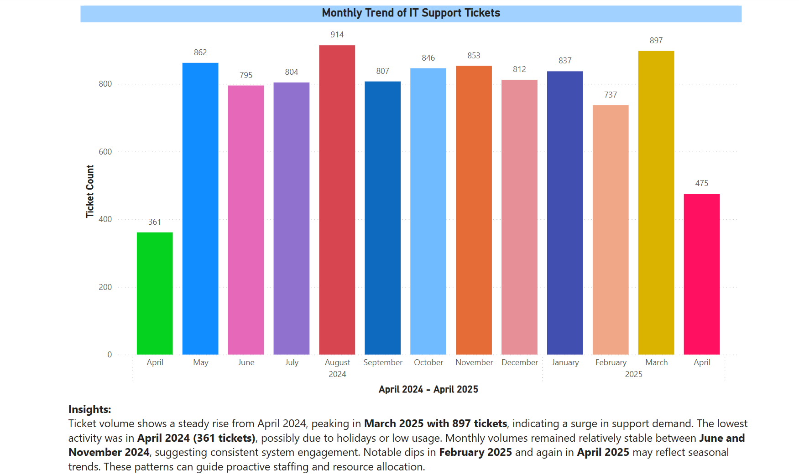
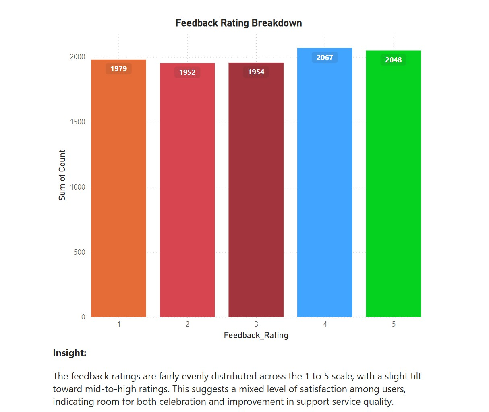
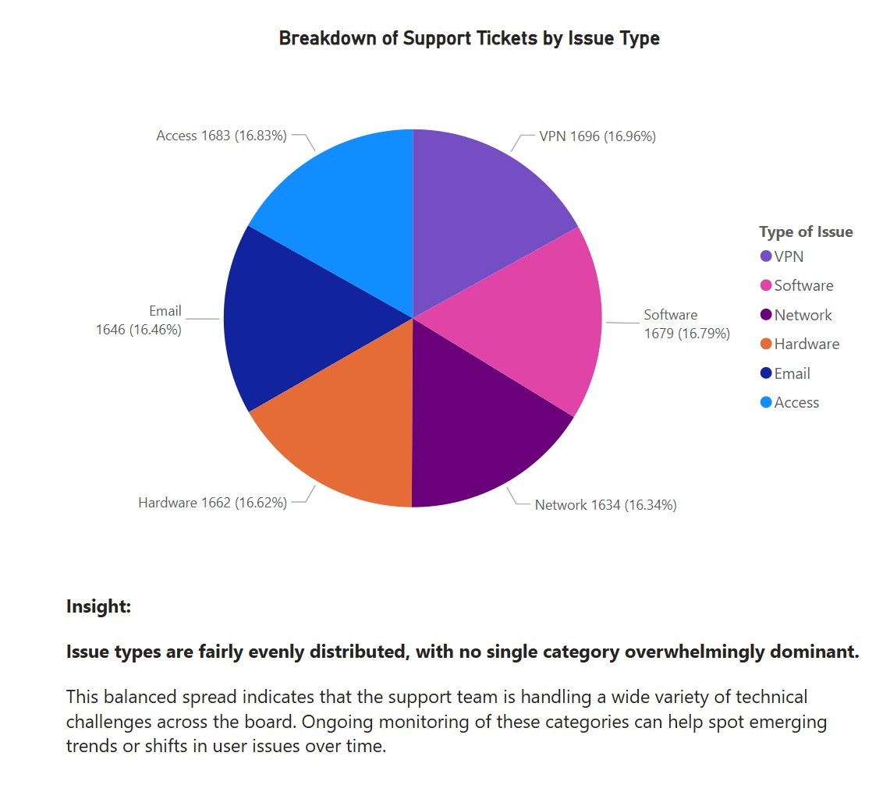
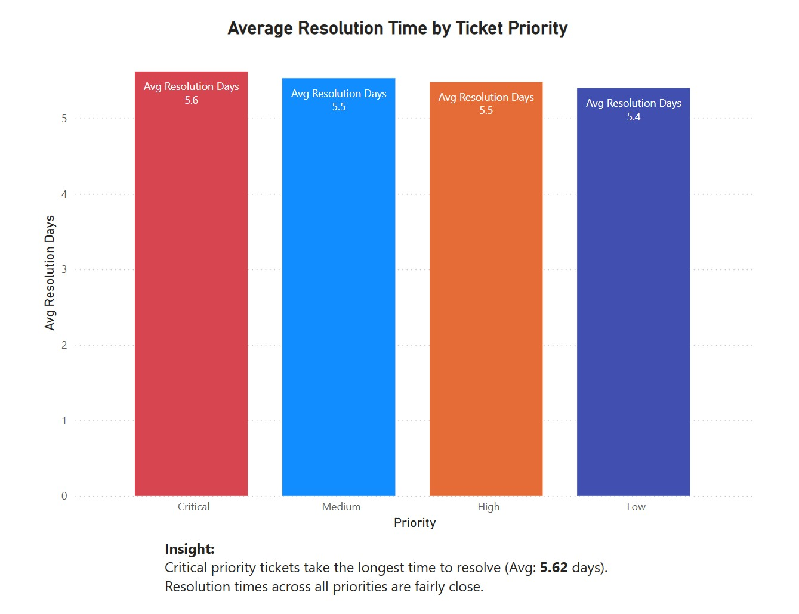

# IT Support Ticket Analysis Dashboard

A deep-dive data analysis project focused on IT support ticket performance across multiple departments. This project was built to explore trends, efficiency, workload distribution, and service quality using SQL and Power BI.
---
## Overview

Welcome to my SQL project focused on analyzing support ticket data from an IT department. This project simulates a real-world IT service desk environment. With thousands of tickets logged over a year, the dataset was cleaned, analyzed using SQL, and visualized in Power BI. The final output delivers clear insights for decision-makers on how support operations are performing.

---

## 🔍 What’s This Project About?

This project is based on a fictional IT support dataset. I used **MySQL** to write queries that answer practical business questions like:

- Which departments log the most support tickets?
- Are technicians closing tickets on time?
- Which issues take the longest to resolve?
- Who are the most efficient technicians?
- Are SLAs being breached frequently, and by whom?

The idea here is to show how SQL isn't just about syntax—it's about solving real problems and finding insights that teams can actually act on.

---

## Project Goals
- Track monthly ticket volume trends
- Identify which departments raise the most tickets
- Analyze SLA breaches and performance
- Measure feedback ratings and tech efficiency
- Deliver actionable insights through visual dashboards

---

## 💡 What You'll Find Inside

- ✅ Clean, structured SQL queries
- ✅ Department-wise SLA breach analysis
- ✅ Technician performance breakdown
- ✅ Resolution time averages by priority
- ✅ Ticket volume trends over time

Every query is based on a real question you'd hear in an IT team meeting or during an operational review.

---

## 🧰 Tools & Tech Stack
- **MySQL Workbench** – SQL data queries and transformations  
- **Power BI** – Interactive dashboard visualizations  
- **Excel** – Data formatting & exporting  
- **GitHub** – Version control and documentation  

---

## 📁 About the Dataset

This dataset includes over **10,000 support tickets** and covers fields like:

- Department  
- Issue Type  
- Priority  
- Status (Open/Closed/Escalated)  
- Created and Resolved Dates  
- Assigned Technician  
- SLA Breach Flags  
- Feedback Ratings  

> **Data Source**: Synthesized IT support ticket logs  
> **Total Records**: 13 months of support ticket data  
> **File Format**: `.xlsx` with multiple sheets

---

## SQL Insights

We performed SQL queries to gather the following insights:

| Insight | Description |
|--------|-------------|
| **Tickets by Department** | IT logged the highest number of support tickets |
| **Resolution Times** | Critical and High priority tickets took longer to resolve |
| **SLA Breaches** | Finance had the highest number of SLA breaches |
| **Top Technicians** | Bob and Frank resolved the most tickets |
| **Monthly Trends** | March 2025 saw the highest volume of tickets |
| **Feedback Ratings** | Consistent ratings with no major outliers |

> View all queries in: [`/SQL/Insights.sql`](SQL/Insights.sql)

---

## 👋 Why I Built This

I wanted to create a project that not only showcases SQL syntax but also reflects how data is used in real business environments. IT support teams run into these issues daily—and this analysis could actually help optimize their operations.

If you're reviewing this as a potential employer:  
👉 This is the kind of hands-on work I enjoy doing. It's logical, structured, and rooted in real use cases.

---

## 📬 Let's Connect

If you're into data analysis, tech ops, or just curious about SQL:

🔗 [[LinkedIn](#)  ](https://www.linkedin.com/in/srinivasbharathsurisetty/)
📫 Feel free to drop me a message!

---

## Power BI Dashboard

The full dashboard is available in `.pbix` format:  
**[Download Dashboard](Dashboard/IT_Support_Ticket_Analysis_Data.pbix)**

> **Key Dashboards:**
- Ticket Volume by Month
- SLA Breaches by Department
- Technician Performance
- Feedback Distribution
- Issue Type Breakdown

Screenshots below:

  

---

## 📁 Folder Structure

Here's how this project is structured:

/ ├── assets/ → Visual assets used in README and dashboard
│ ├── banner.png → Project banner image
│ ├── Average Resolution Time by Ticket Priority.jpg
│ ├── Breakdown of Support Tickets by Issue Type.jpg
│ ├── Feedback Rating Breakdown.jpg
│ ├── Monthly Trend of IT Support Tickets.png
│ ├── SLA Breaches by Department.jpg
│ ├── Ticket Status Distribution.jpg
│ ├── Ticket Volume by Department.jpg
│ ├── Tickets Resolved by Technicians.jpg
│ └── .gitkeep → Keeps the folder in version control if empty
│ ├── data/ → Final cleaned dataset
│ ├── IT_Support_Ticket_Analysis_Data.xlsx → Master Excel file with multiple sheets
│ └── .gitkeep → Keeps the folder in version control if empty
│ ├── visuals/ → Power BI visuals & report file
│ ├── IT Support Ticket Analysis Data.pbix → Power BI project file
│ └── .gitkeep → Keeps the folder in version control if empty
│ ├── IT_Support_Ticket_Analysis.sql → SQL file with all transformation & insights queries
├── README.md → Project documentation you're reading now

---

## How to Use

1. Clone the repo  
2. Open SQL scripts in MySQL Workbench  
3. Explore `.pbix` in Power BI Desktop  
4. Use visuals or modify as per your project goals

---

## Author

Created with detail and precision by Srinivas Bharath Surisetty — blending SQL insights with visual storytelling.
